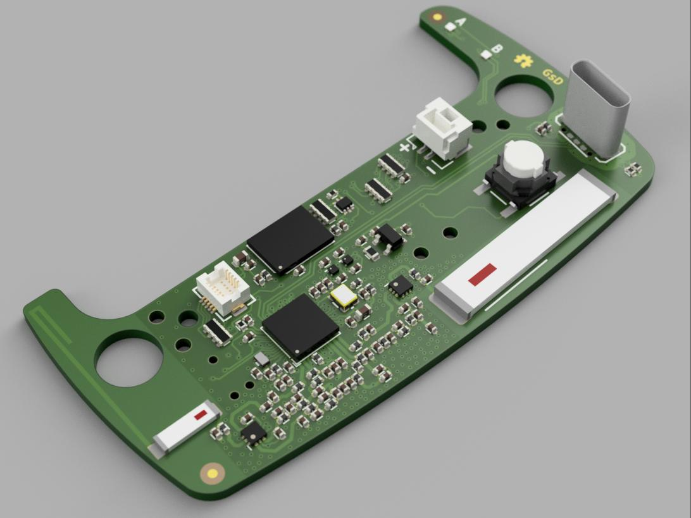
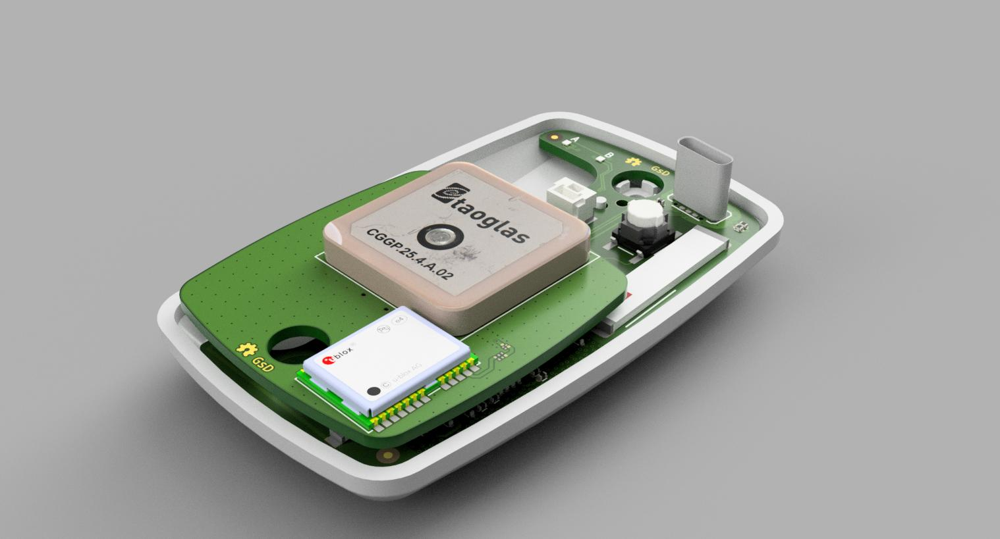

# gpsLogger

	Project Stage: Work in progress. 
	v0.1a Design complete. 
	Waiting for prototypes. 
	(Chance of bugs: _HIGH_)

A basic portable GPS logger with LoRa wireless based on Microchip ATSAMR34

v0.1a PCB has been designed to accomidate both 433MHz and 868/915MHz bands. However support may be dropped for 433MHz in the future.

The PCB is design to fit in an existing enclosure used by a previous GPS datalogger.

