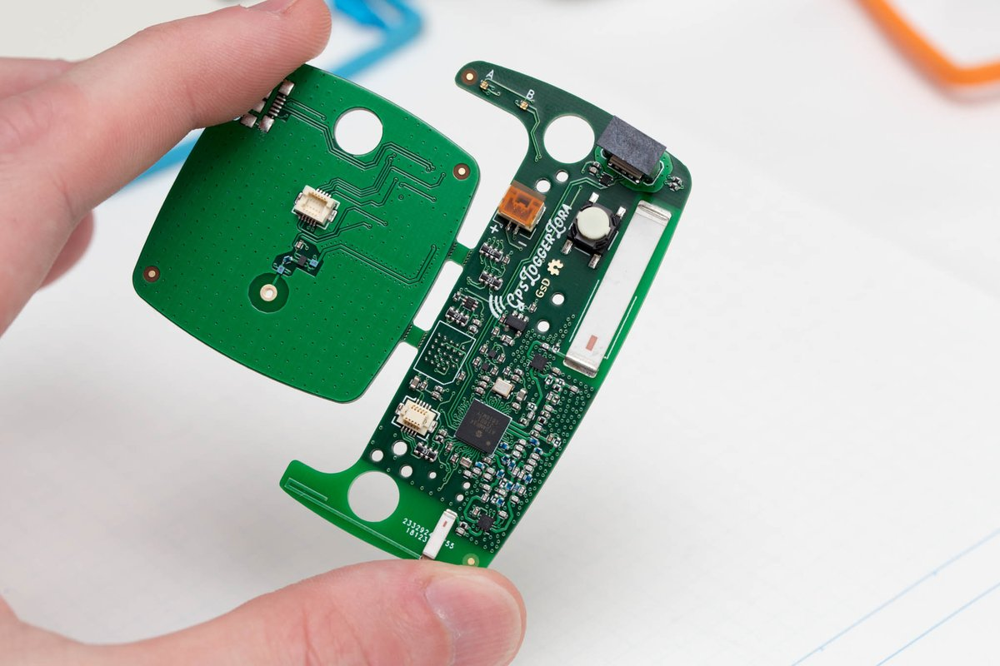
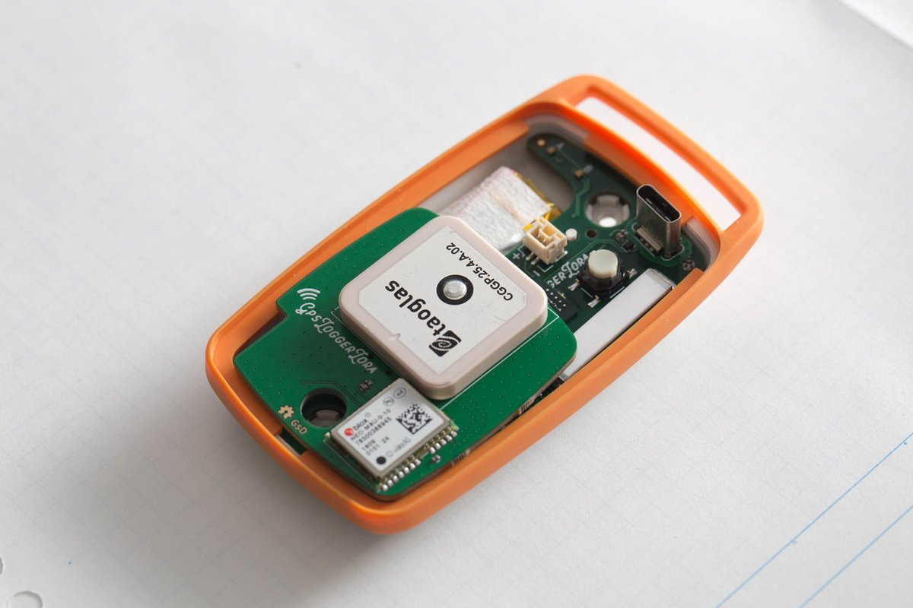
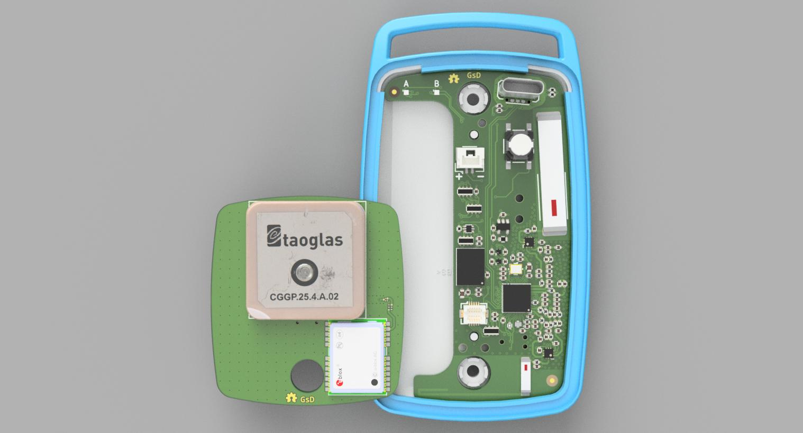

# gpsLogger

	Project Stage: Firmware Devlopment
	v0.1a Prototyp Assembled
	Current Bugs:
	 * FLASH footprint wrong (fix in v0.2)
	 * Change BOM MCP73812 (CE pin) to MCP73832 (STATUS pin)
	 * Small changes to RF paths
	 * Update solderpaste apertures on X2SON parts (too much paste)
	 * Needs more test-points 
	 * LED colours B/G swapped

A basic portable GPS logger with LoRa wireless based on Microchip ATSAMR34

v0.1a PCB has been designed to accomidate both 433MHz and 868/915MHz bands. However support may be dropped for 433MHz in the future.

The PCB is design to fit in an existing enclosure used by a previous GPS datalogger.
